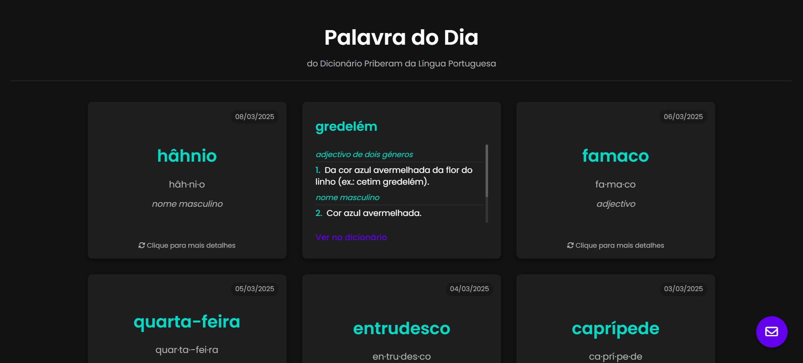
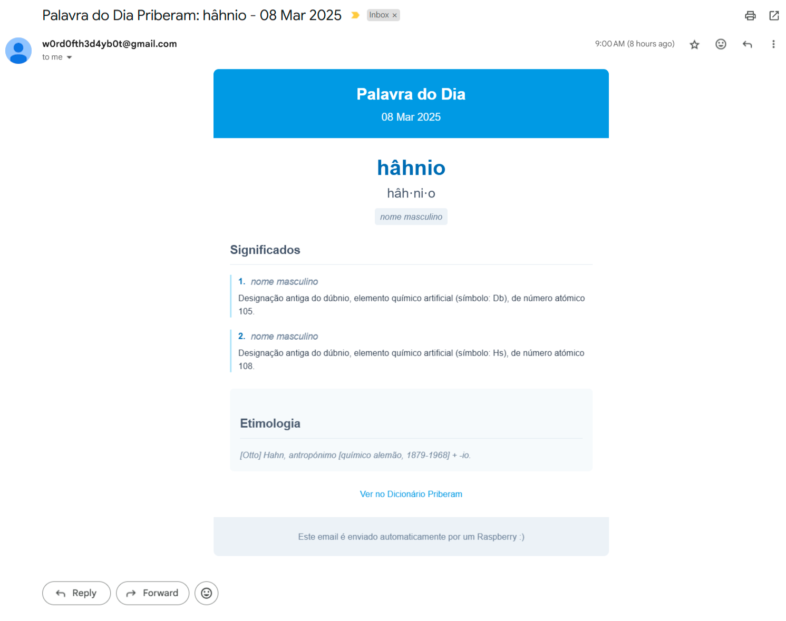

# Word of the Day

This project consists of two main components:

- **Website:** A web application that fetches and displays the latest "Word of the Day" from the Priberam Dictionary. The site uses a combination of Netlify functions, HTML, CSS, and JavaScript to render the word details.
  
- **Daily Email Service:** A Python script running on a Raspberry Pi. It sends an email every day (using a crontab job) to all subscribers with the "Word of the Day" details. Subscribers can sign up via the website.

## Features

- **Live Updates:** Automatically fetches word details (including syllables, meanings, etymology, etc.) from the Priberam RSS feed.
- **Email Notifications:** Uses the Gmail SMTP server and Supabase to manage subscribers and send formatted emails daily.
- **Responsive Design:** The website is designed with responsive CSS for optimal viewing on all devices.

## Setup and Installation

1. **Clone the Repository:**
   ```bash
   git clone <repository-url>
   cd wordoftheday
   ```

2. **Environment Variables:**
   Create a `.env` file in the project root (or in the relevant folders) with the following keys:
   - `SUPABASE_URL`
   - `SUPABASE_KEY`
   - `EMAIL_ADDRESS`
   - `EMAIL_PASSWORD`

3. **Install Dependencies (for the Website):**
   ```bash
   npm install
   ```

4. **Local Development (Website):**
   Start the local development server using:
   ```bash
   npm run dev
   ```

5. **Deploy (Website):**
   Since the project uses Netlify functions, deploy the site to Netlify. Ensure the functions folder and publish directory are correctly set in `netlify.toml`.

6. **Raspberry Pi Email Service:**
   - Place the Python script (`WOTD-mail/wotd-mail.py`) on your Raspberry Pi.
   - Install the required Python packages (`requests`, `beautifulsoup4`, `supabase`, etc.).
   - Set up a cron job to trigger the script daily:
     ```bash
     crontab -e
     # Add a new line:
     0 8 * * * /usr/bin/python3 /path/to/WOTD-mail/wotd-mail.py >> /path/to/wotd-mail/wotd.log 2>&1
     ```
     Adjust the time (here 8 AM) and paths as needed.

## File Structure

- `netlify/functions/`  
  Contains Netlify serverless functions for fetching words and handling subscriber emails.

- `public/`  
  Contains the website's assets including HTML, CSS, and JavaScript.

- `WOTD-mail/`  
  Contains the Python script that fetches the daily word and sends emails to subscribers.

- `.env`  
  Contains environment variables required for Supabase and email credentials.

## Screenshots

For a quick preview of the project, see the screenshots below:





